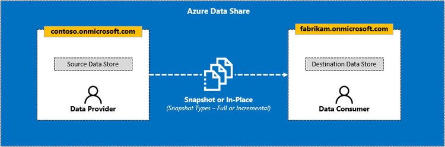

# Azure Data Share
Azure Data Share is a fully managed service that enables organisations to share data across tenants (B2B), simply and securely. Data can be consumed as needed by triggering a full copy or incremental update. Alternatively, data can be received automatically at a regular interval, as defined by the data provider.

## Lab Prerequisites
**Data Provider**
1. [Azure Subscription](https://azure.microsoft.com/en-us/free/)
2. [Create an Azure Resource Group](https://docs.microsoft.com/en-us/azure/azure-resource-manager/management/manage-resource-groups-portal#create-resource-groups) (e.g. datashare_rg_provider)
3. [Create an Azure Storage Account](https://docs.microsoft.com/en-us/azure/storage/common/storage-account-create?tabs=azure-portal) (e.g. datastorageprovider<random_id>)
4. Create a container within your Storage Account (e.g. sales)
5. Upload some dummy data files within the container (e.g. sales001.csv, sales002.csv, etc.)
4. [Create an Azure Data Share Account](https://docs.microsoft.com/en-us/azure/data-share/share-your-data#create-a-data-share-account) (e.g. datashare_acct_provider)

**Data Consumer**
1. [Azure Subscription](https://azure.microsoft.com/en-us/free/)
2. [Create an Azure Resource Group](https://docs.microsoft.com/en-us/azure/azure-resource-manager/management/manage-resource-groups-portal#create-resource-groups) (e.g. datashare_rg_consumer)
3. [Create an Azure Storage Account](https://docs.microsoft.com/en-us/azure/storage/common/storage-account-create?tabs=azure-portal) (e.g. datastorageconsumer<random_id>)
4. Create a container within your Storage Account (e.g. landing-zone)
5. [Create an Azure Data Share Account](https://docs.microsoft.com/en-us/azure/data-share/share-your-data#create-a-data-share-account) (e.g. datashare_acct_consumer)

Disclaimer:
* For the purposes of the demo, the set of Azure resources for both the data provider (Contoso) and the data consumer (Wingtip Toys) will belong to the same Azure subscription under the same tenant.
* In reality, a more likely scenario will involve the data provider and data consumer belonging to completely distinct organizations (i.e. B2B) with their own Azure subscriptions under seperate tenants.
* That said, the process of creating a data share, having an invitation sent out, the invitation being accepted, and ultimately the data consumer mapping the shared data into their environment is the same.

## Lab Modules
* Lab 1 - [Create a Sent Share](/labs/01_create_share.md)
* Lab 2 - [Accept an Azure Data Share Invitation](/labs/02_accept_invitation.md)