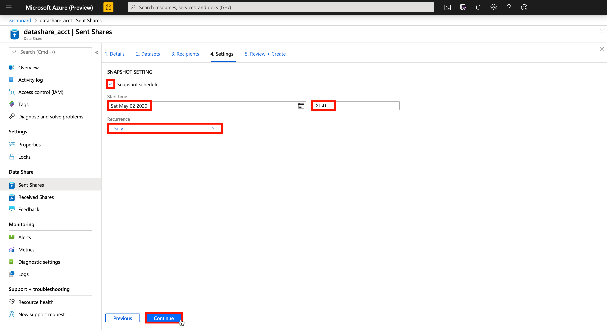

# 1. Create a Sent Share

## Table of Contents
[Azure Data Share Lab](../README.md)
* Lab 1 - Create a Sent Share
* Lab 2 - [Accept an Azure Data Share Invitation](../labs/02_accept_invitation.md)
* Lab 3 - [Map Dataset to Target Data Store](../labs/03_configure_dataset.md)
* Lab 4 - [Configure a Snapshot Schedule](../labs/04_configure_snapshot.md)
* Lab 5 - [Trigger Snapshot](../labs/05_trigger_snapshot.md)

## Overview
| Persona | Time | Action |
| -----  | ----- | ----- |
| Data Provider | 10 minutes | Create a data share |

## Summary
In this lab, you will:
* Create a data share
* Add a dataset
* Invite recipients
* Configure a snapshot schedule
* Monitor invitations

## Steps

1. Navigate to your Azure Data Share resource
2. Click **Sent Shares**
3. Click **Create**

4. Populate the following fields:
    * Share Name (e.g. share_contoso_sales)
    * Share Type (Snapshot)
    * Description
    * Terms of use

5. Click **Continue**

6. Click **Add datasets**

7. Select **Azure Blob Storage**
8. Click **Next**

9. Under **Subscriptions** select your Azure subscription
10. Under **Resource groups** select the resource group that contains the Azure Blob Storage account
11. Expand the storage hierarchy and select the **sales** container
12. Click **Next**
")

13. Provide a **Dataset Name** (e.g. dataset_contoso_sales)
14. Click **Add datasets**
")

15. Click **Continue**

16. Click **Add recipient**
17. Enter the recipients Azure login email address
18. Click **Continue**

19. Click the checkbox to enable **Snapshot schedule**
20. Choose a desired **Start time** by configuring the date and time fields
21. Select a **Recurrence** (e.g. Daily)
22. Click **Continue**

23. Review the details of your share and click **Create**
- Number of datasets
- Name of data share
- Description
- Terms of use
- Number of recipients
- Snapshot settings

At this point, you will return to the **Sent Shares** screen and see several notifications indicating that your share has been created successfully.
* New data share was created successfully
* Invitations were added successfully
* Datasets were added successfully

Note: As part of the data share creation process, the Azure Data Share resource is granted the appropriate level of access to read from the source data store, in this case - **Storage Blob Data Reader**. This can be verified by navigating to the Azure Storage Account > Access Control (IAM) and clicking **Role assignments**.

24. To monitor the status of your invitations, navigate to the **`[data_share_account]` > Sent Shares > `[data_share_name]` > Invitations**. You should see the following attributes:  
    * Shared With (Email Address)
    * Status (e.g. Pending)
    * Shared By (Full Name)
    * Shared On (Date Time)
