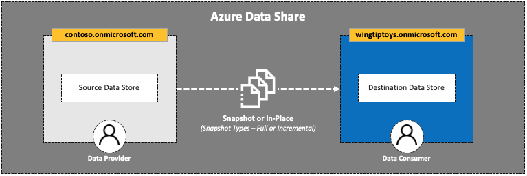

# 2. Accept an Azure Data Share Invitation

## Table of Contents
[Azure Data Share Lab](../README.md)
* Lab 1 - [Create a Sent Share](../labs/01_create_share.md)
* Lab 2 - Accept an Azure Data Share Invitation
* Lab 3 - [Map Dataset to Target Data Store](../labs/03_configure_dataset.md)
* Lab 4 - [Configure a Snapshot Schedule](../labs/04_configure_snapshot.md)
* Lab 5 - [Trigger a Snapshot](../labs/05_trigger_snapshot.md)

## Overview
| Persona | Time | Action |
| -----  | ----- | ----- |
| Data Consumer | 5 minutes | Accept invitation |

## Summary
In this lab, you will:
* Open an Azure Data Share invitation
* Review the terms of use
* Map the share to a target data share account
* Create a share subscription

## Steps

1. Open your email client to review the invitation
2. Click **View invitation**

Once logged in, you will see a list of **Data Share Invitations** with the following attributes:
* Invitation
* Sender
* Company
* Status (e.g. Pending)
* Received On (Date Time)  
3. Click **`[invitation_name]`**

Review the details of the invitation:
* From (Full Name)
* Company
* Number of datasets
* Description
* Terms of use

4. Click **I agree to terms of use**
5. Map the **Target Data Share Account**
   * Subscription
   * Resource group
   * Data share account
   * Received share name
6. Click **Accept and configure**

At this point, you will return to the **Received Shares** screen and see a notification that you have successfully created a share subscription.
