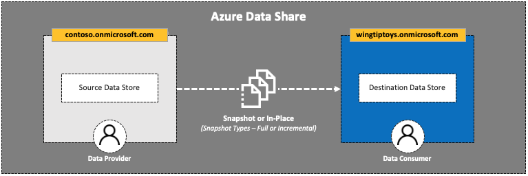
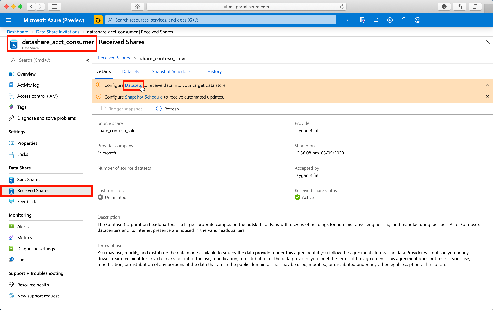
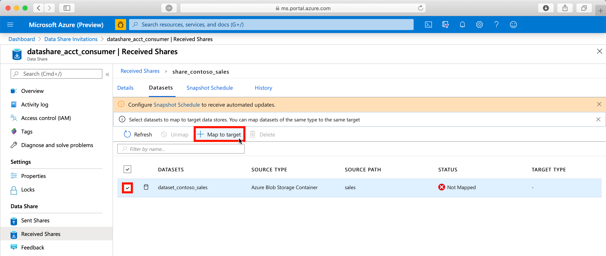
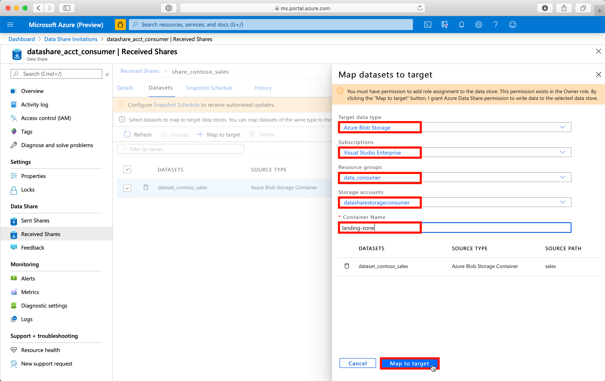
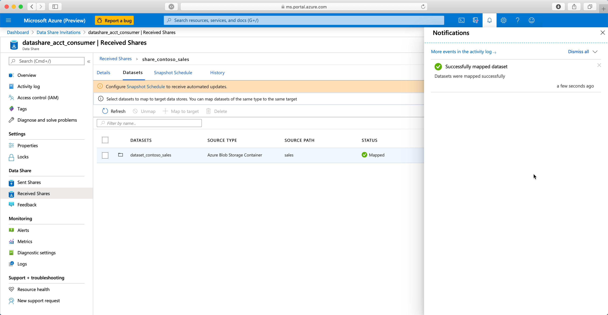
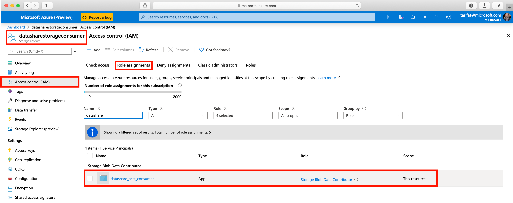

# 3. Map Dataset to Target Data Store

[Azure Data Share Lab](../README.md) > Map Dataset to Target Data Store

## Overview
| Persona | Time | Action |
| -----  | ----- | ----- |
| Data Consumer | 5 minutes | Map to target |

## Summary
In this lab, you will:
* Configure a dataset to receive data into your target data store
* Map the shared dataset to a target store (Azure Blob Storage)
* Review Azure Data Share role assignment

## Steps

1. Navigate to your Azure Data Share resource
2. Click **Received Shares**
3. Click **Datasets**

The next screen will show a list of datasets within the share with the following attributes:
*  Dataset Name
* Source Type (e.g. Azure Blob Storage Container)
* Source Path (e.g. sales)
* Status (e.g. Not Mapped)
* Target Type

4. Select the dataset (e.g. dataset_contoso_sales) by clicking the checkbox
5. Click **Map to target**

6. Map the dataset to target datastore by making the following selections:
    * Target data type (e.g. Azure Blob Storage)
    * Subscription
    * Resource group
    * Storage account
    * Container name (e.g. landing-zone)
7. Click **Map to target**

At this point, you will return to the **Received Shares** screen and see a notification that the dataset was mapped successfully.

Note: As part of the data share subscription process, the Azure Data Share resource is granted the appropriate level of access to write to the target data store, in this case - **Storage Blob Data Contributor**. This can be verified by navigating to the Azure Storage Account > Access Control (IAM) and clicking **Role assignments**.

