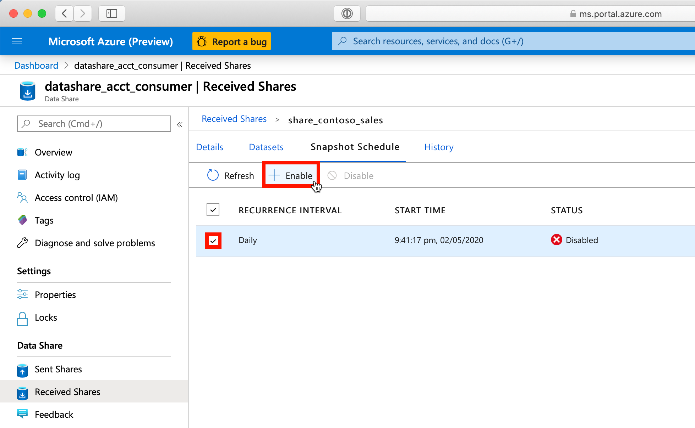
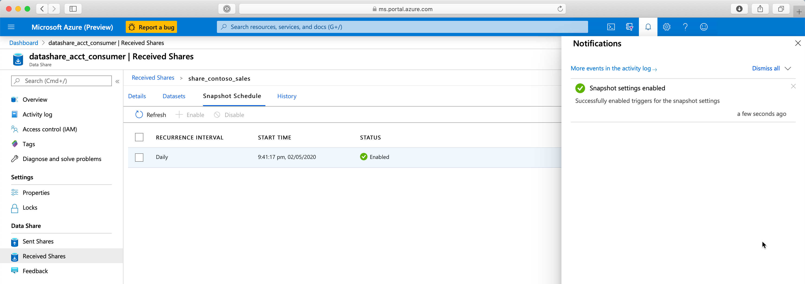

# 4. Configure a Snapshot Schedule

## Table of Contents
[Azure Data Share Lab](../README.md)
* Lab 1 - [Create a Sent Share](../labs/01_create_share.md)
* Lab 2 - [Accept an Azure Data Share Invitation](../labs/02_accept_invitation.md)
* Lab 3 - [Map Dataset to Target Data Store](../labs/03_configure_dataset.md)
* Lab 4 - Configure a Snapshot Schedule
* Lab 5 - [Trigger Snapshot](../labs/05_trigger_snapshot.md)

## Overview
| Persona | Time | Action |
| -----  | ----- | ----- |
| Data Consumer | 5 minutes | Enable snapshot schedule |

## Learnings
In this lab, you will:
* Review snapshot schedules provided by the data provider
* Enable the available snapshot schedule

## Steps

1. Navigate to your Azure Data Share resource
2. Click **Received Shares**
3. Click **`[share_name]`** (e.g. share_contoso_sales)
4. Click **Snapshot Schedule**

5. Select the schedule that has been made available by the data provider
6. Click **Enable**

Once complete, you will see a notification confirming that the snapshot schedule has been successfully enabled.
