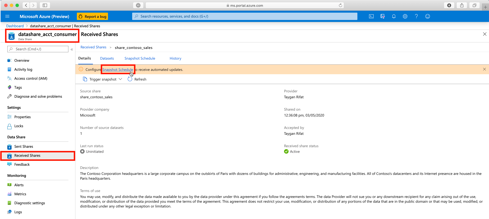

# 4. Trigger a Snapshot

## Table of Contents
[Azure Data Share Lab](../README.md)
* Lab 1 - [Create a Sent Share](../labs/01_create_share.md)
* Lab 2 - [Accept an Azure Data Share Invitation](../labs/02_accept_invitation.md)
* Lab 3 - [Map Dataset to Target Data Store](../labs/03_configure_dataset.md)
* Lab 4 - [Configure a Snapshot Schedule](../labs/04_configure_snapshot.md)
* Lab 5 - Trigger Snapshot

## Overview
| Persona | Time | Action |
| -----  | ----- | ----- |
| Data Consumer | 5 minutes | Trigger snapshot |

## Learnings
In this lab, you will:
* Trigger a full copy snapshot
* Trigger an incremental snapshot

## Steps

1. Navigate to your Azure Data Share resource
