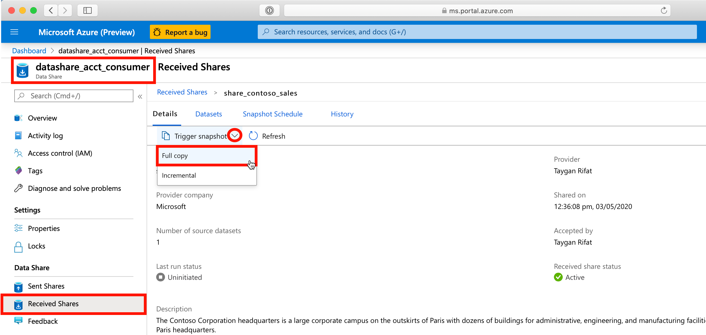
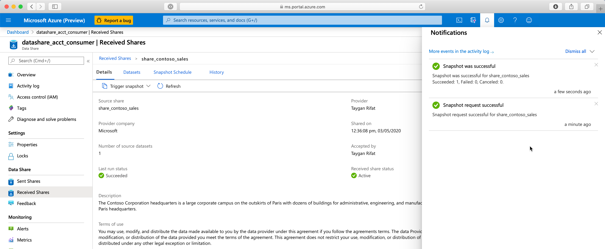
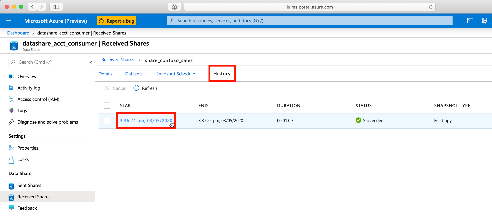
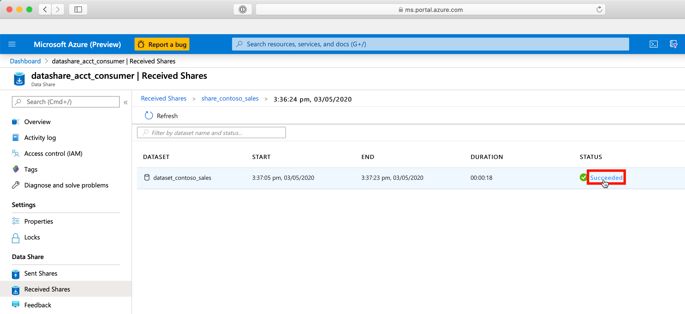
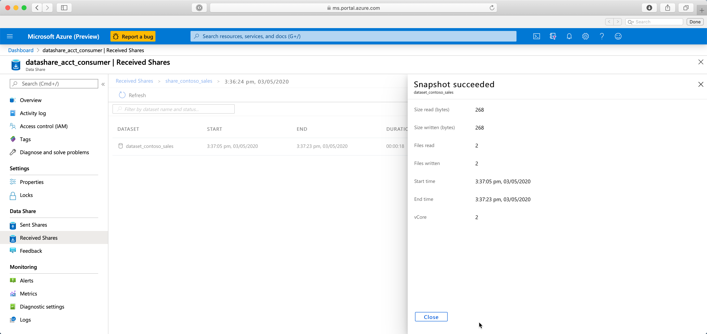

# 4. Trigger a Snapshot

## Table of Contents
[Azure Data Share Lab](../README.md)
* Lab 1 - [Create a Sent Share](../labs/01_create_share.md)
* Lab 2 - [Accept an Azure Data Share Invitation](../labs/02_accept_invitation.md)
* Lab 3 - [Map Dataset to Target Data Store](../labs/03_configure_dataset.md)
* Lab 4 - [Configure a Snapshot Schedule](../labs/04_configure_snapshot.md)
* Lab 5 - Trigger a Snapshot

## Overview
| Persona | Time | Action |
| -----  | ----- | ----- |
| Data Consumer | 5 minutes | Trigger snapshot |

## Learnings
In this lab, you will:
* Trigger a full copy snapshot
* Review the snapshot execution history
* Review the metrics logged for each data movement activity

## Steps

1. Navigate to your Azure Data Share resource
2. Click **Received Shares**
3. Click **`[share_name]`** (e.g. share_contoso_sales)
4. Click **Trigger snapshot**
5. Select **Full copy**

Once complete, you will see a notification that the snapshot request was successful followed by confirmation that the snapshot itself was successful. Note: The time required to complete the request will vary depending on a number of variables (e.g. source type, target type, number of files, volume of data, etc.).

6. To get more details about the snapshot execution, click **History** where you will see the following attributes:
* Start (Date Time)
* End (Date Time)
* Duration (HH:MM:SS)
* Status (e.g. Succeeded)
* Snapshot Type (e.g. Full Copy)

7. Click the lastest hyperlinked snapshot execution for more information

This next level of granularity provides a status by dataset. Remember: A single data share can contain many datasets. Attributes shown at this level include:
* Dataset
* Start (Date Time)
* End (Date Time)
* Duration (HH:MM:SS)
* Status (e.g. Succeeded)

8. Click on the *Status* to drill down further into the data movement metrics

At this point, you will see logged information including:
* Size read (bytes)
* Size written (bytes)
* Files read
* Files written
* Start time
* End time
* vCore

9. Click **Close**

